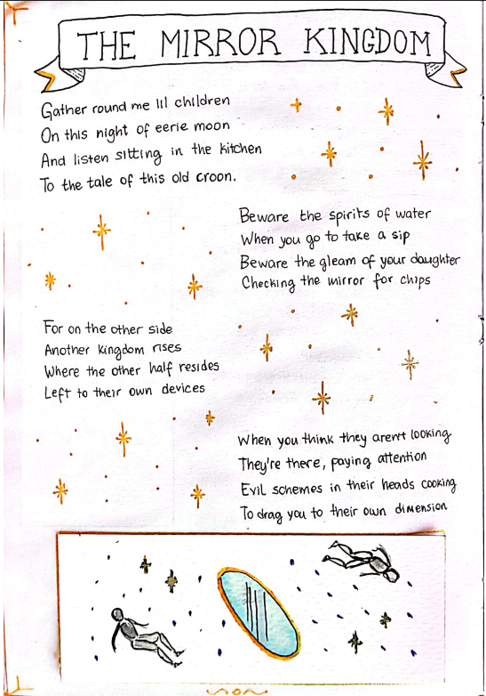
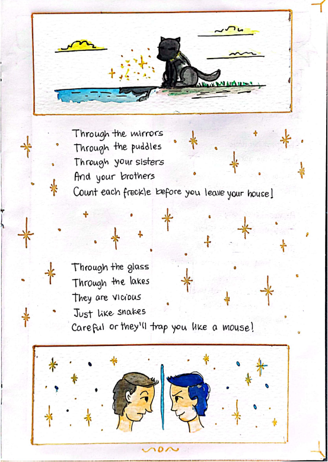

# The Mirror Kingdom

Una ronda para asustar chicos, cantada por una vieja en la cocina.

> Gather round me lil children
> On this night of eerie moon
> And listen sitting in the kitchen
> To the tale of this old croon.
>
> Beware the spirits of water
> When you go to take a sip
> Beware the gleam of your daughter
> Checking the mirror for chips
>
> For on the other side
> Another kingdom rises
> Where the other half resides
> Left to their own devices
>
> When you think they aren't looking
> They're there, paying attention
> Evil schemes in their heads cooking
> To drag you to their own dimension
>
> Through the mirrors
> Through the puddles
> Through your sisters
> And your brothers
> Count each freckle before you leave your house!
>
> Through the glass
> Through the lakes
> They are vicious
> Just like snakes
> Careful or they'll trap you like a mouse!
{: .verse}

## Páginas originales

